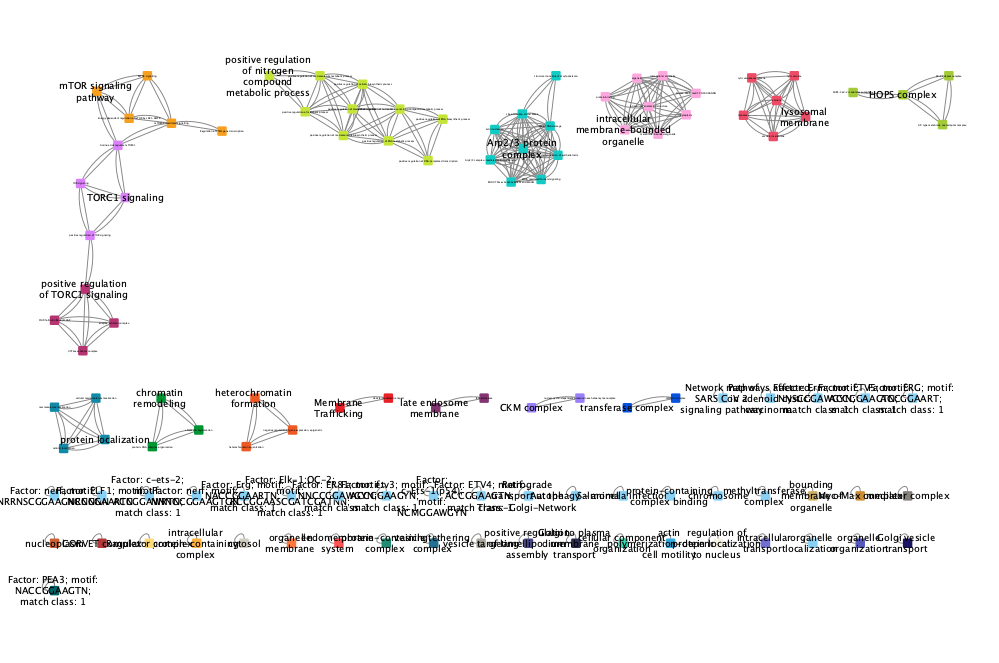

# FunJacc
Summarising functional enrichment terms using clustering

Here I am developing code to summarise gProfiler output using Jaccard similarity of term-associated gene lists and clustering

This is still very much under development!!!

## Usage

Prerequisites:

- Conda/Mamba
- Git

**Clone Git repository**

`git clone https://github.com/adamjamesreid/FunJacc.git`

`cd FunJacc`

**Setup mamba environment**

`mamba env create -f funjacc.yaml -n funjacc`

`mamba activate funjacc`

**Execute snakemake pipeline**

Your input file should be in a directory called 'input' and be named '{string}.list'. The {string} can be anything you like.

To run snakemake you need to specify the final output file, so here we arbitrarily pick one of them, which will be the file of cluster annotation, found in a new directory called 'funjacc_res'. It will be named with the {string} used in your input file, so here, replace {string} with the same characters that are before '.list' in your input file

`snakemake funjacc_res/{string}.ann.txt`

To run the test data:

`snakemake funjacc_res/test.ann.txt`

**Options**

The way the code runs can be adjusted by editing the 'config.yaml' config file.

`organism: hsapiens`
The species used by gProfiler to interpret the gene list you provide e.g. hsapiens, mmusculus, dmelanogaster, 

`function_types: GO:BP,GO:MF,GO:CC,CORUM,KEGG,REAC,WP,TF`
The functional resources to include in the clustering

`p_cut: 0.01`
The p-value cut off for gProfiler results to be included in clustering

`jacc_cut: 0.5`
The Jaccard index cut off for indentifying links between terms

`inflation: 1.4`
The MCL inflation parameter for determining clusters

**Output**

- ./gprofiler/{string}.gprofiler.out - Initial output from Gprofiler

- ./funjacc_res/{string}.ann.txt - Cluster annotations, which can be read into Cytoscape
- ./funjacc_res/{string}.gprofiler.tsv - Gprofiler output, annotated with FunJacc cluster numbers and names
- ./funjacc_res/{string}.ntwrk.txt - FunJacc network file which can be read into Cytoscape
- ./funjacc_res/{string}.ntwrk.txtdata.mci - MCL output file
- ./funjacc_res/{string}.ntwrk.txtdata.mci.inf1.4 - MCL output file
- ./funjacc_res/{string}.ntwrk.txtdata.mci.inf1.4.clusters.txt - MCL output file
- ./funjacc_res/{string}.ntwrk.txt.data.tab - MCL output file

The most useful output is perhaps './funjacc_res/{string}.gprofiler.tsv'. this can be opened in e.g. Excel and then the enriched terms can be sorted by cluster number. By grouping the many terms into their clusters, it becomes more clear what aspects of biology are represented by the gene list.

**Visualise the clustering in Cytoscape**

You can get Cytoscape from [here](https://cytoscape.org/download.html)

Open Cytoscape. *File -> Import -> Network from File*: test.ntwrk.txt

*File -> Import -> Table from File*: test.ann.txt (n.b. *Import Data as: Node Table Columns*)

*File -> Import -> Styles from File*: funjacc_cytoscape_style.xml

Then select the FunJacc Cytoscape Style under the style templates

## Usage avoiding snakemake

**Run gprofiler**

`Rscript run_gprofiler.R test.list test.out hsapiens`

**Cluster using all terms types**

`python3  funjacc.py -g test.out -d GO:BP,GO:MF,GO:CC,CORUM,KEGG,REAC,WP,TF`

